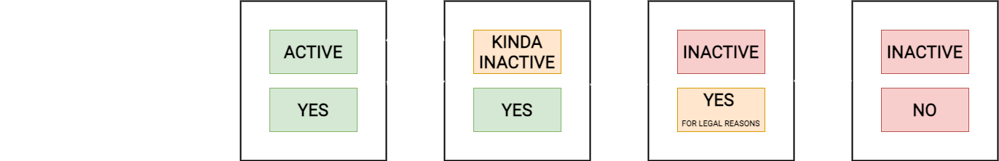
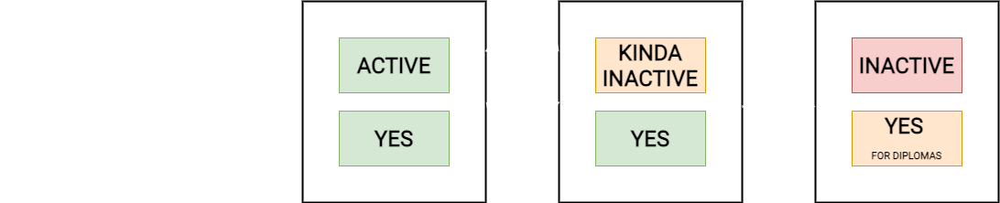
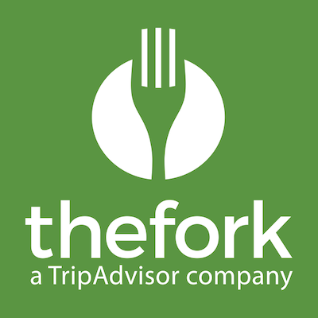
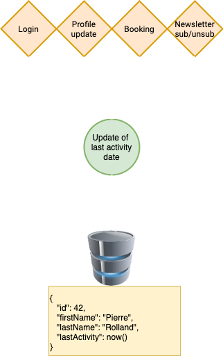
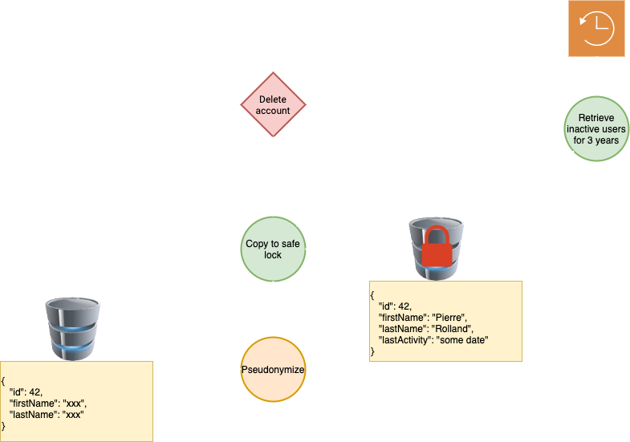
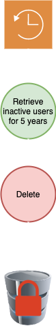

# Anonymization

Pierre Rolland

13 Jan. 2021

---

## Context

- Backend devs have full access to the personal data of the users (mostly because of Support Requests)
- Dumps aren't anonymized before retrieval
- Users data are not automatically destroyed (but can be manually)

---

## What's a personal data?

----

### Anything that is related to a physical person

- Name, pseudonym, birth date
- Phone number, postal address, email address
- IP, session id, cookie id
- Physical imprint (finger print, eye print, etc.)
- Car number, social security number, ID or passport number
- Application usage (comments, avatar, etc.)

---

## Are there personal data that are more sensitive than other?

----

### Yes

> A specific consent must be accepted to be able to collect them

- Health
- Sexual life or orientation
- Ethnical origin
- Political opinions
- Genetic data

---

## What's **NOT** considered as a personal data?

----

### Anything that doesn't relate directly to a physical person

- Company information (name, global phone number, global email)

---

## How to identify people from this data?

----

### By a single data

A passport ID obviously, but a first name can also be enough

----

### By crossing the data

Crossing a postal address with a birth date for instance

---

## Personal data lifecycle

----

### In most cases

----

### For OpenClassrooms premium users 

---

## A user has the right to be forgotten

Which means their data shouldn't be retrievable once the forgetting process has been initiated

----

## But a company may need to remember them

> In case of litigation, a company should be able to retrieve their data for a dedicated amount of time after the user has been "forgotten"

Which means the data should still be somewhere else, in a safe lock with extremely restricted access, during this period.

---

## How a user can be forgotten?

----

### At their own initiative

By putting a "Delete my account" functionality.

_For litigations, their data must be kept in the safe lock. At OC, the diplomas should be kept as well._

----

### At the company initiative

By deleting inactive accounts

_Still for litigations, their data must be kept in the safe lock if the inactivity period is lower than the legal delay._

_Or, for OC premium users, always_

---

## Is there a legally defined amount of time for keeping the data?

----

### No

----

### But it has to be defined, and tools exist to help

> https://www.cnil.fr/fr/les-durees-de-conservation-des-donnees

---

## Anonymization
## VS
## Pseudonymization

---

## Anonymization

> Making **impossible** any user identification through a dataset

_Once an anonymization has been made, none of GDPR requirements are appliable anymore_

----

### An anonymization process is irreversible

----

#### Individualization

It is no longer possible to identify a person through the dataset

----

#### Correlation

It is no longer possible to link records coming from several databases to a user entry

----

#### Inference

It is impossible to deduce information on an individual through a dataset (search for an hospital in the region, and on "how to raise kids" => The person may be pregnant)

---

## Pseudonymization

> A compromise between keeping the raw data and producing anonymized datasets

_Pseudonymized data is still considered as personal data, and thus remains submitted to GDPR rules_

----

### A pseudonymization process is reversible

----

#### How to

- The personal data is hashed
- The real data is kept in a safe lock
- There are technical and organisational measures to prevent reidentification

---

## A developer doesn't need users data to work efficiently
The more a data is shared, the more it's likely to leak, or to be used in a malicious way

----

#### Local dumps should be

- At least anonymized when downloaded
- At best constituted of fake users data

----

#### Prod access to users data should be prohibited

- By restraining access to the most sensitive columns
- By providing all the keys to support teams 

---

## What are the risks in case of personal data leak?

----

### Penal and financial

> 300k euros and possibility to have a lawsuit from the given people 

----

### Reputation

---

## Concrete flow at TheFork

----

### Update last activity when needed

----

### Pseudonymize when requested or too old

----

### Delete once the legal delay is passed

---

## And for OpenClassrooms?

----

### OpenClassrooms is a website and a school

- Website users may be considered as any kind of users, and be submitted to these rules
- But they must have access to their diplomas
	- This may be done by sending them their documents before pseudonymization while keeping those documents permanently in the safe lock

----

### But OpenClassrooms also provides free courses

For those who never had a premium account, there is no reason nor benefit to anyone to keep their data after a long time of inactivity

---

## Questions ? :)
