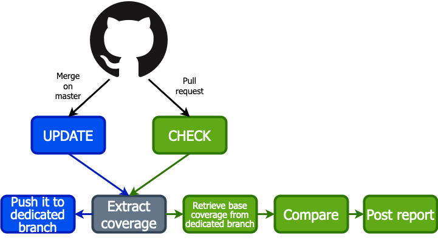
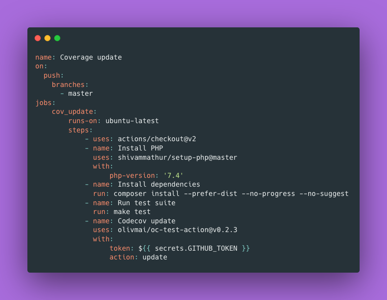
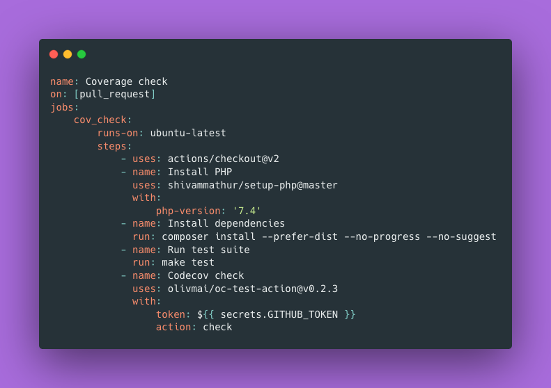
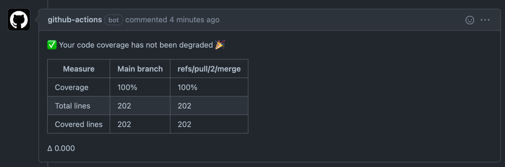
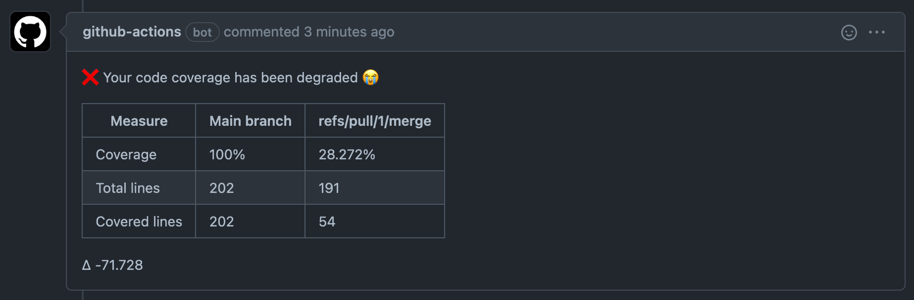

# Codecov replacement

---

## Why do we use codecov?

- Know if we didn't degrade the coverage
- Have a small report on diff
- Have an history of coverage changes

---

## What do we want to do?

- Do it with a Github Action
- Benefit from Github to have the history

---

## Glossary

A github action can be

- An automated process
- A reusable step to be used in those processes

We chose to create an action that can be used in actions :)

---

## Why?

- Can be useful if we go multirepo
- Can be cool to show OC initiative to the world

---

## What are the concerns?

- Coverage is not persisted
	- And we don't want to run tests twice to compare
- Coverage has to be calculated from clover file

---

## The action

---

## Config for coverage update

---

## Config for coverage check

---

## Result on check success

---

## Result on check failure

---

## Execution time on PR

- Action: 2s
- Codecov: > 20s

---

## Repo

https://github.com/olivmai/oc-test-action
