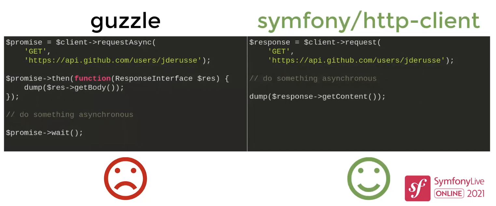

Pierre Rolland 

21 Apr. 2021


---

## Contents

- Keynote
- Serverless
- HTTP Client & AWS
- Identifiers
- Integrations tests

---

## Keynote

----

## About new technologies

- Use them only if needed for your context
- Learning/mastering/monitoring a new techno is a huge cost
- Production is more important than fun
- Fun may be there at first but not on the long term
- Techno on Docker ≠ Techno in production

----

## Don't redo everything yourself

- Rely on SaaS
- But not necessarily on their SDKs

----

## Ideal stack for @fabpot

- VM on a PaaS
- Managed PostgreSQL
- CDN
- Bunch of SaaS

----

## About Symfony

- Stop relying on LTS from now on
- Mature enough to do regular updates (every 6 months)

---

## Serverless

----

## FaaS vs CaaS

- FaaS
	- Functions executions
	- Ephemeral
	- Pay at function execution
- CaaS
	- Infrastructure handling
	- Monitoring

----

## To do what?

- Webhooks
- Multimedia treatment
- IoT
- Event streaming (pubsub, queuing)
- Workflow automation (batch treatments)

----

## Pros

- No infrastructure handling
- Pay as you go
- Scalable
- Simple deploy
- Focus on business
- Ecology

----

## Cons

- Cold start
- Debug
- No long processes 
	- 15' max for AWS, 9' for GCP
- Provider limitations
	- Body size, memory, ...
- Unpredictable cost
- Vendor lock-in
	- Costly to learn, costly to change

----

## Serverless framework

- CLI + Dashboard (serverless.com)
- Definition of envs, functions and events
- Functions can live in the same app, but will be standalone for the framework
- Compatible with AWS


----

## Serverless configuration


----

## Serverless deploy & invoke


----

## AWS Lambda

- No native support for PHP
- But doable using layers
- Layers can't exceed 250 MB

----

## Layers

Reusable archives between functions


----

## Runtime

> Executable file that will execute a Lambda function's handler when this function is called

In our case, the runtime will be a PHP binary with all the required extensions and configuration


----

## Runtime phases

- Initialization
	- Turns the environment on, happens once
- Invokation
	- Waits for functions to be called

_No real control of when an environment turns off, depends on a lot of cloud provider parameters_

----

## Bref

- Open-source library 
	- `composer require bref/bref`
- Includes PHP 7 & 8 runtimes
- Includes docs & tools (to deploy for instance)
- PHP popular framework integrations

----


----

## Few things to be aware of

- Read-only FS (redirect logs & cache to /tmp)
- Execute `composer install` locally before deploy

----

## What could be the benefits for us?

- Email (or any kind of notification) sending
- PDF generation
- Heavy treatmens (analytics?)
- ...

----

## Examples

https://github.com/MarieMinasyan/php-serverless

---

## HTTP Client & AWS

----

## HTTP Client



----

## Retryable Client


----

## AWS SDK Pros

- Feature complete
- Maintained
- Documented

----

## AWS SDK Cons

- No auto-completion
- Unreadable code (@method annotation)
- Duplicate methods for sync or async needs
- Takes a single arguments (`array $args`), returns a single response (`Result` for sync, `Promise` for async)

----

## In Symfony

- Symfony relies a lot on AWS tools
- But it doesn't rely at all on AWS SDK
- => It's only basic support

----

## AWS SDK vs Symfony

- Hard to integrate AWS SDK with Symfony tools (debug bar, etc.)
- Impossible to maintain the custom implementation (10 294 operations, new ones everyday)

----

## Good news

The SDK also provides a biiiig JSON file describing all the operations

----

## async-aws

- Symfony created its own fully typed SDK based on the JSON & HTTP Client
- With the help of a code generator
- Automated (ran everyday)

https://github.com/async-aws/aws

----

## Typed response to work with


----

## Sync vs async


----

## Async behavior example


---

## Identifiers

----

- Perfectly OK to have several kinds in a system
- Perfectly OK to use all the formats depending on the use case
- Can be good to question if an id should be functional or technical

----

## Integers

----

### Pros

- Easy to use
- Easy to understand
- Auto-incrementable
- Sortable
- Performant

----

### Cons

- Generable from a single point (db)
- Guessable
- Information leak (amount of entries)
- Provides no context

----

## Random strings

----

### Pros

- Generable from outside
- Not guessable
- Prefixable

----

### Cons

- Harder to use
- Harder to understand
- Harder to generate
- Less performant
- Not sortable

----

## UUIDs

- Big integer (128 bits)
- Theoretically unique
- Six versions


**Canonical display:**

ce83dbda-99e3-<u>**4**</u>24f-a74c-9236d08f2bce

----

### Time-based UUIDs (v1 & v6)

- Encapsulate a timestamp in the first segment
- V6 is widely used but not official
- V1 is not sortable and leaks MAC address in the last segment
- V6 is sortable and randomizes the last segment
- They make perfect primary keys
- But can leak info about timestamp by design

----

### Name-based UUIDs (v3 & v5)

- Generated from a namespace and a name
- Can be reproductible from several places
- v3 uses md5
- v5 uses sha1

----

### Random-based UUIDs (v4)

- All segments are fully random
- Not sortable
- Perfect for tokens

----

### Crap-based UUIDs (v2)

- Legacy, not RFC-compatible, do not use

----

## ULIDs

- Also 128 bits
- 48 bits for timestamp, 80 random
- Sortable
- Smaller canonical form
- No RFC, but a spec on Github (came out from a 2016 JS implementation)
- Compatible with UUIDs (displayable as UUID canonical form as they share the same amount of bits)

----

## UUIDs & ULIDS

- Generable offline
- Do not store them as varchars ! (use UUID type)

----

## UIDs in Symfony

- Historically: `ramsey/uuid`
- Since Symfony 5.1: `symfony/uid` (for UUIDs and ULIDs)

----

## `symfony/uid`

- Since 5.3, the component is no more experimental
- Provides complete factories to generate UUIDs
- Provides commands to generate, or inspect UUIDs (single or batch)


----

## Functional vs technical ids segregation

- Friendly IDs for functional 

`session_52ifdNsoCcCRKFsbV1cj6j`
- UUIDs in DB 

`a58008a1-a972-4de7-bd7b-42234fd2bd23`
- `SessionIdentifier` in the code

----

## Use argument value resolvers

```php
/**
 * @Route("/sessions/{sessionId}")
 */
public function __invoke(SessionIdentifier $id): JsonResponse
```

```php
class SessionIdentifierArgumentValueResolver implements ArgumentValueResolverInterface
{
	public function supports(Request $request, ArgumentMetadata $metadata): bool
	{
		return $request->attributes->has('sessionId') && 
			$metadata->getType() === SessionIdentifier::class;
	}

	public function resolve(Request $request, ArgumentMetadata $metadata): iterable
	{
		yield SessionIdentifier::from($request->attributes->get('sessionId'));
	}
}
```


----

## Strategies to change an identifier

- v2
- Duplicated code to handle both
- Generating new identifiers for all entries

----


----

## Nest resolvers

```php
class FallbackSessionIdentifierArgumentValueResolver implements ArgumentValueResolverInterface
{
	public function resolve(Request $request, ArgumentMetadata $metadata): iterable
	{
		try {
			yield from $this->inner->resolve($request, $argument);
		} catch (NotFoundHttpException $e) {
		}

		try {
			yield $this->legacyIdRepository
			    ->find($request->attributes->get('sessionId'));
		} catch (SessionIdNotFoundException $e) {
			throw new NotFoundHttpException();
		}
	}
}
```

---

## Integration tests

----

## Fixtures library

> `composer require --dev zenstruck/foundry`


----

## Create fixtures factories


----


----


----

## Create fixtures from the factories


----

## Create fixtures from the test itself


----

## Don't worry about your schema


---

## Questions?
